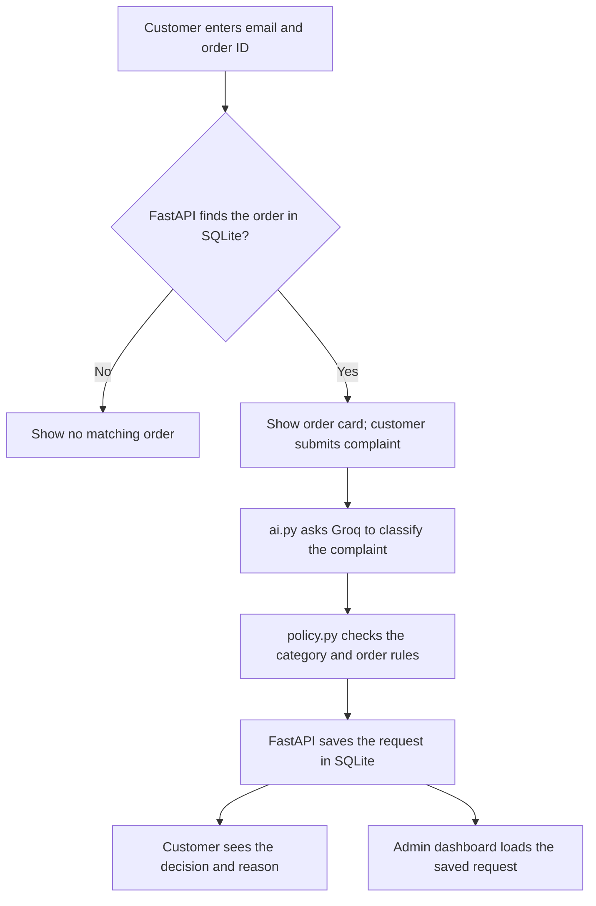

# Worknoon AI Powered Customer Support Refund System Demo

A containerized refund request demo built with Streamlit, FastAPI, SQLite, and Groq. Customers find a mock order, describe an issue, and see a decision with a reason. A support dashboard shows recent requests, AI categories, decisions, and audit notes.


## Tech Stack


## Requirements

- Docker Desktop with Docker Compose
- A Groq API key from [GroqCloud](https://console.groq.com/keys)

## Run locally

1. Copy the template in the project root to a private `.env` file:

   ```powershell
   Copy-Item .env.example .env
   ```

   On macOS or Linux, use `cp .env.example .env`.

2. Edit `.env` and replace both placeholders:

   ```text
   GROQ_API_KEY=your_own_groq_key
   ADMIN_TOKEN=your_chosen_admin_token
   ```

   Create your key in the [GroqCloud console](https://console.groq.com/keys). The admin token is a value you choose for this local demo(the value can be anything word or number of your chosing); enter that same value on the app's Admin Access page.

3. From the project root, start both services:

   ```powershell
   docker compose up --build
   ```

4. Open the customer app at **http://localhost:8501**. The FastAPI documentation is available locally at **http://localhost:8000/docs**.

5. To stop the app, press `Ctrl+C`, then run `docker compose down`. The named SQLite volume remains available for the next run. `docker compose down -v` also removes that volume and its saved requests.

## Architecture and request flow



## 15 Customers Details for testing the flow 
| Customer | Email | Order ID 1 | Order ID 2 |

| Ada Okafor | ada.okafor@example.com | WN-1001 | WN-2001 |
| Chidi Nwosu | chidi.nwosu@example.com | WN-1002 | WN-2002 |
| Amina Bello | amina.bello@example.com | WN-1003 | WN-2003 |
| Tunde Adebayo | tunde.adebayo@example.com | WN-1004 | WN-2004 |
| Zainab Musa | zainab.musa@example.com | WN-1005 | WN-2005 |
| Emeka Obi | emeka.obi@example.com | WN-1006 | WN-2006 |
| Ngozi Eze | ngozi.eze@example.com | WN-1007 | WN-2007 |
| Femi Adeyemi | femi.adeyemi@example.com | WN-1008 | WN-2008 |
| Fatima Usman | fatima.usman@example.com | WN-1009 | WN-2009 |
| Kunle Ajayi | kunle.ajayi@example.com | WN-1010 | WN-2010 |
| Ifeoma Okeke | ifeoma.okeke@example.com | WN-1011 | WN-2011 |
| Ibrahim Lawal | ibrahim.lawal@example.com | WN-1012 | WN-2012 |
| Sade Williams | sade.williams@example.com | WN-1013 | WN-2013 |
| Yusuf Abdullahi | yusuf.abdullahi@example.com | WN-1014 | WN-2014 |
| Grace Johnson | grace.johnson@example.com | WN-1015 | WN-2015 |


## Try the flow

Use the synthetic customer **ada.okafor@example.com** with order **WN-1001** on Find My Order. Select **Report an Issue** and submit a genuine damaged-item complaint such as “My headphones arrived with a cracked earcup and will not turn on.” The page displays the category-driven decision and reason. Then open Admin Access, enter the `ADMIN_TOKEN` from your private `.env`, and review the saved request on the dashboard.

Other seeded records exercise policy rules: **chidi.nwosu@example.com / WN-1002** is final sale; **amina.bello@example.com / WN-1003** exceeds $500; **tunde.adebayo@example.com / WN-1004** starts outside the 30-day window. Each customer also has a second, older order. Purchase dates are fixed when the database is first seeded, so the 30-day result changes as those orders age.


## How the Ai integration works


The backend uses Groq to classify free-text customer complaints (i.e it takes what ever statement or sentence the customer writes and classifies it...) into damaged, incorrect, other, unclear, or suspicious. The classification is passed to a deterministic Python refund policy, which also checks the order’s purchase date, amount, and final-sale status. The policy produces the decision and reason; Groq does not control the refund rules or modify orders. If classification fails or returns an invalid category, the request is treated as unclear and escalated for review. The complaint, category, decision, and reason are saved for the admin dashboard.


## How it works

The Streamlit frontend sends order lookups and complaints to the FastAPI backend. FastAPI reads the SQLite order data, sends complaint text to Groq for one of five categories (`damaged`, `incorrect`, `other`, `unclear`, or `suspicious`), and applies the refund rules in Python. The model supplies a category; it does not directly approve a refund or edit an order. FastAPI stores the complaint, category, decision, and reason for the admin dashboard.

The policy checks suspicious or unclear complaints for human review, denies final-sale or out-of-window orders, escalates otherwise eligible requests above $500, approves qualifying damaged or incorrect items, and denies other complaints. If classification fails or its output is invalid, the request falls back to `unclear` and is escalated. The admin API checks the token on the backend before returning request records.

## Project structure

- `frontend/app.py` — Streamlit entry point and navigation
- `frontend/pages/` — order lookup, complaint form, admin access, and dashboard
- `backend/main.py` — API endpoints and request flow
- `backend/ai.py` — Groq classification and output validation
- `backend/policy.py` — deterministic refund decisions
- `backend/database.py` — SQLite schema, seed data, and database access
- `docker-compose.yml` — builds and connects the two services; persists SQLite in a named volume

## Assumptions and trade-offs


A trade off i made is not including or integrating a system to issue out payments or send real emails because
This is an assessment demo with made up customers and orders, it does not issue payments or send real emails. Email plus order ID makes the  flow easy to test but is not sufficient customer authentication for a real store. Admin access uses a shared token chosen by each reviewer rather than individual staff accounts.And an Assumption i also made is that i did not limit the amount of time a person with a certain Order can request for a refund and There is no request cooldown, Assuming who ever wants to review it wants to test it repeatedly.
SQLite is suitable for the small demo dataset; a production service would need stronger identity, abuse protection, and operational storage choices.

## Demo video

[Watch the Worknoon refund demo](PASTE_VIDEO_LINK_HERE)
